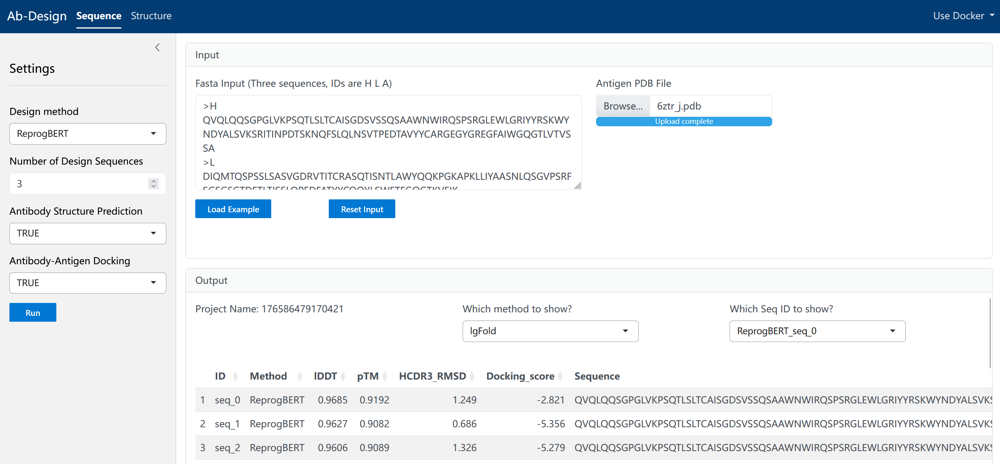

First, clone or download this repository:

```bash
git clone https://github.com/wt12318/AbDesignBech
```

The Docker image file has been uploaded to BaiduYun. The link is https://pan.baidu.com/s/1qh2Qd_4qtfArk0VKzdXlFQ?pwd=44st. You can load it after downloading.

```bash
docker load -i abdesigner_last.tar
docker load -i rfantibody_last.tar
```

If an error occurs：`docker: Error response from daemon: could not select device driver "" with capabilities: [[gpu]]`，You can run the following code（refer to [https://stackoverflow.com/questions/75118992/docker-error-respon...](https://stackoverflow.com/questions/75118992/docker-error-response-from-daemon-could-not-select-device-driver-with-capab)）

```bash
#1. Configure the repository:
curl -fsSL https://nvidia.github.io/libnvidia-container/gpgkey |sudo gpg --dearmor -o /usr/share/keyrings/nvidia-container-toolkit-keyring.gpg \
&& curl -s -L https://nvidia.github.io/libnvidia-container/stable/deb/nvidia-container-toolkit.list | sed 's#deb https://#deb [signed-by=/usr/share/keyrings/nvidia-container-toolkit-keyring.gpg] https://#g' | sudo tee /etc/apt/sources.list.d/nvidia-container-toolkit.list \
&& sudo apt-get update
#2. Install the NVIDIA Container Toolkit packages:
sudo apt-get install -y nvidia-container-toolkit
#3. Configure the container runtime by using the nvidia-ctk command:
sudo nvidia-ctk runtime configure --runtime=docker
#4. restart docker 
sudo systemctl restart docker
```

Start Docker images：

```bash
##change /home/wt/Ab_Design/ to your path 
docker run -itd --privileged -v /usr/bin/docker:/usr/bin/docker -v /var/run/docker.sock:/var/run/docker.sock -v /home/wt/Ab_Design/test:/home/ab/run/run_test --name abdesigner_last --gpus all abdesigner_last /bin/bash
##docker exec -it --user ab abdesigner_last bash
docker run -itd --name rfantibody_wt --gpus all --memory 100g rfantibody_last bash
```

This Docker image requires a `toml` file to run, which can be placed in the `test` folder (such as `seq_config.toml` below):

```bash
##run sequence design models
docker exec --user ab abdesigner_last /bin/bash -c "source /home/ab/miniconda3/bin/activate; python /home/ab/run/run_seq.py -c /home/ab/run/run_test/seq_config.toml"
```

The `toml` file is look like following (for sequence design and structure design)：

```bash
###sequence
[input]
fasta_file = "/home/ab/run/run_test/her2_abag.fasta"
ag_pdb_file = "/home/ab/run/run_test/her2_ag.pdb"
[settings]
design_method = ["IgLM"]
design_num = 10
pre_structure = true
docking = true
out_path = "/home/ab/run/run_test/output/"

###structure
[input]
pdb_file = "/home/ab/run/1n8z_B_C.pdb"
[settings]
design_method = ["DiffAb","AbOpt","AbDockgen","RFantibody"]
design_num = 5
Heavy_Chain = "B"
Antigen_Chain = "C"
binding_affinity = true
binding_energy = true
out_path = "/home/ab/run/output/"
```

We built a Shiny App based on Docker for easier user operation. The code is in `app.R`. You need to first start the two corresponding Docker images according to the steps above, and then click `Run App` in RStudio or run it in the terminal (you need to modify `AbRSA_path` and `tmp_dir` in the `app.R` file to set the AbRSA path and temporary file directory path):

```bash
shiny::runApp("path/to/app.R")
```



